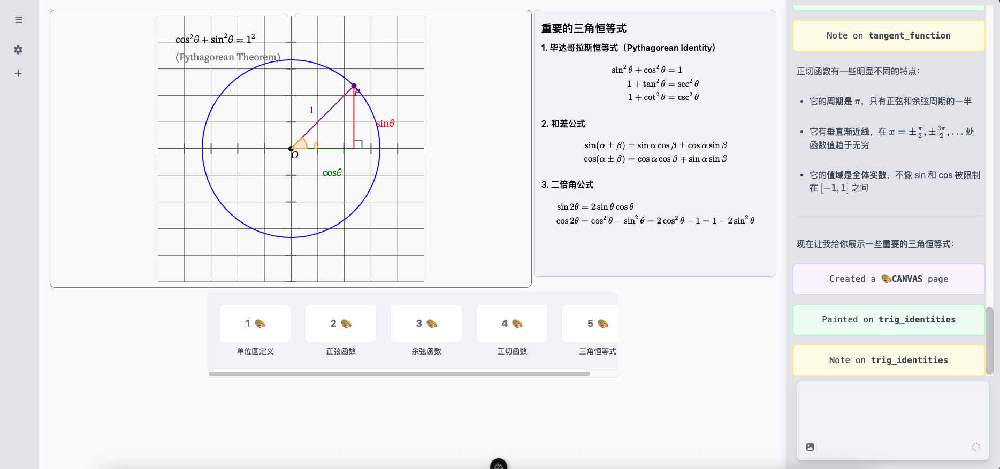

<div align="right">
  <span>[<a href="./README.md">English</a>]<span>
  </span>[<a href="./README_CN.md">简体中文</a>]</span>
</div>  

<div align="center">

  <h1>ChatTutor</h1>

  <p>Visual and Interactive AI Tutor</p>
  
  <div align="center">
    
    
    
    
    
    
  </div>
  
</div>

---

ChatTutor is an AI teacher equipped with the ability to use an electronic whiteboard.

Traditional chatbots interact with users primarily through text, which is sufficient in most scenarios. However, with the development of LLM in recent years, more and more people are using AI to assist their learning. In a real-world classroom, teachers have many teaching tools—chalk, computers, blackboards, and other teaching aids—that help students better understand knowledge. But for a chatbot, text can convey very limited information, especially in STEM subjects.

ChatTutor effectively solves this problem by bringing all the teaching tools used in real-world educational scenarios to the forefront, allowing users to interact with them through electronic devices. We've empowered AI with the ability to use these tools, enabling AI to become a truly hands-on teacher.

## Features

- [x] Math Canvas

- [ ] Code Page
- [x] Mindmap

- [ ] Physics Canvas
- [ ] Digital Logic Canvas
- [ ] Problem Solving created by AI to user

## Roadmap
Please refer to our [Roadmap v0.1](https://github.com/sheepbox8646/ChatTutor/issues/1) for the detailed roadmap

## Quick Start

### Environment

- Node.js >= 20
- Postgres
- PNPM

### Environment Variables

```bash
cp .env.example .env
```

Fill your config in `.env` file.

- `MODELS`: The models to use, use ',' to divide models.
- `API_KEY`: The API key to use.
- `BASE_URL`: The base URL to use.
- `DATABASE_URL`: The Postgres URL to use.

### Initialize

```bash
pnpm i
pnpm db:push # Init
```

### Run

```bash
pnpm dev
```

## Projects Used on Core Features

- [xsai](https://github.com/moeru-ai/xsai): Extra-small AI SDK.
- [jsxgraph](https://jsxgraph.org/): Interactive geometry, function plotting, and data visualization library.

---
**MIT License**

*Copyright (c) 2025 Acbox, All rights reserved.*