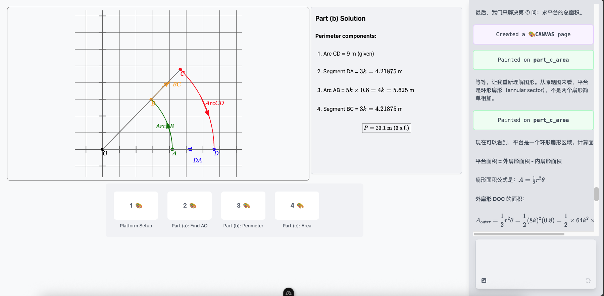
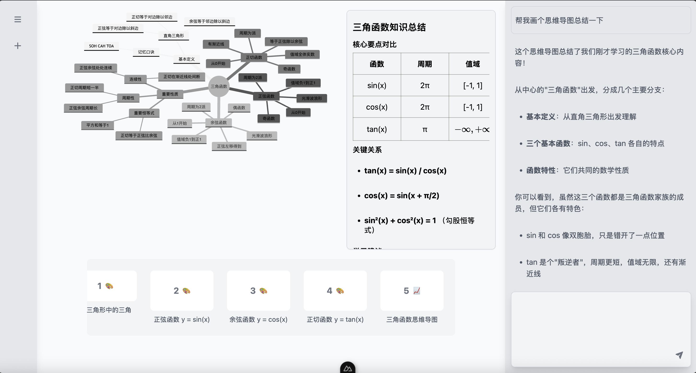

<div align="right">
  <span>[<a href="./README.md">English</a>]<span>
  </span>[<a href="./README_CN.md">简体中文</a>]</span>
</div>  

<div align="center">

  

  <h1>ChatTutor</h1>

  <p>Visual and Interactive AI Tutor</p>
  
  <div align="center">
    
    
    
    
    
    
  </div>
  
</div>

---

> [!NOTE]
>
> Online Website: ChatTutor is available at [https://chattutor.app](https://chattutor.app), please set your own API key and models in the settings. ([https://chattutor.app/settings](https://chattutor.app/settings))

ChatTutor is an AI teacher equipped with the ability to use an electronic whiteboard.

Traditional chatbots interact with users primarily through text, which is sufficient in most scenarios. However, with the development of LLM in recent years, more and more people are using AI to assist their learning. In a real-world classroom, teachers have many teaching tools—chalk, computers, blackboards, and other teaching aids—that help students better understand knowledge. But for a chatbot, text can convey very limited information, especially in STEM subjects.

ChatTutor effectively solves this problem by bringing all the teaching tools used in real-world educational scenarios to the forefront, allowing users to interact with them through electronic devices. We've empowered AI with the ability to use these tools, enabling AI to become a truly hands-on teacher.

We've implemented a reactive DSL syntax that mimics the reactive system of modern frontend frameworks, based on `@vue/reactivity`, allowing Agents to interact with users through reactive variables and control element behavior by modifying reactive variables. Additionally, we've built a math component library with beautiful animation effects.

> [!NOTE]
>
> For DSL implementation details, refer to the `packages-dsl` directory; for component library implementation, see the `libs` directory.

## Features

##### Math Canvas
<table>
  <tr>
    <td>
      
    </td>
    <td>
      
    </td>
  </tr>
  <tr>
    <td>
      
    </td>
  </tr>
</table>

##### Interactive Forms
<table>
  <tr>
    <td>
      
    </td>
  </tr>
</table>

##### Code Page (🚧 WIP)

##### Mindmap
<table>
  <tr>
    <td>
      
    </td>
    <td>
      
    </td>
  </tr>
</table>

##### Physics Canvas (🚧 WIP)

##### Digital Logic Canvas (🚧 WIP)

##### Problem Solving created by AI to user (🚧 WIP)

## Roadmap
Please refer to our [Roadmap v0.1](https://github.com/HugeCatLab/ChatTutor/issues/1) for the detailed roadmap

## Quick Start

### Environment

- Node.js >= 20
- Docker

### Environment Variables

```bash
cp .env.example .env
```

Fill your config in `.env` file.

> [!NOTE]
>
> ChatTutor employs a **Multi-agent** architecture, where ***Agent*** represents the agent that chats with the user, and ***Painter*** is an expert agent for drawing mathematical graphs.

- `API_KEY`: The API key to use.
- `BASE_URL`: The base URL to use.
- `AGENT_MODEL`: The model to use for the agent.
- `PAINTER_MODEL`: The model to use for the painter. Suggest: `claude-sonnet-4.5` (optional, default to `AGENT_MODEL`)
- `TITLE_MODEL`: The model to use for generate chat title (optional, default to `AGENT_MODEL`)
- `DATABASE_URL`: The Postgres URL to use.

> [!WARNING]
>
> If you don't set them, images will be unavailable.
- `OSS_ENDPOINT`: The OSS endpoint to use.
- `OSS_ACCESS_KEY`: The OSS access key to use.
- `OSS_SECRET_KEY`: The OSS secret key to use.
- `OSS_BUCKET`: The OSS bucket to use.
- `OSS_REGION`: The OSS region to use. (optional)

### Run

```bash
git clone https://github.com/HugeCatLab/ChatTutor.git
cd ChatTutor
docker compose up -d
```

## Projects Used on Core Features

- [xsai](https://github.com/moeru-ai/xsai): Extra-small AI SDK.
- [@vue/reactivity](https://github.com/vuejs/core/tree/main/packages/reactivity): Vue's reactive system.

## Sponsors
Our sponsors are listed as follows (in no particular order):

- [AiHubMix](https://aihubmix.com/): Open model hub for AI.

## Star History

[](https://www.star-history.com/#HugeCatLab/ChatTutor&type=date&legend=top-left)

---
**AGPL v3 License**

*Copyright (c) 2025 Acbox, All rights reserved.*