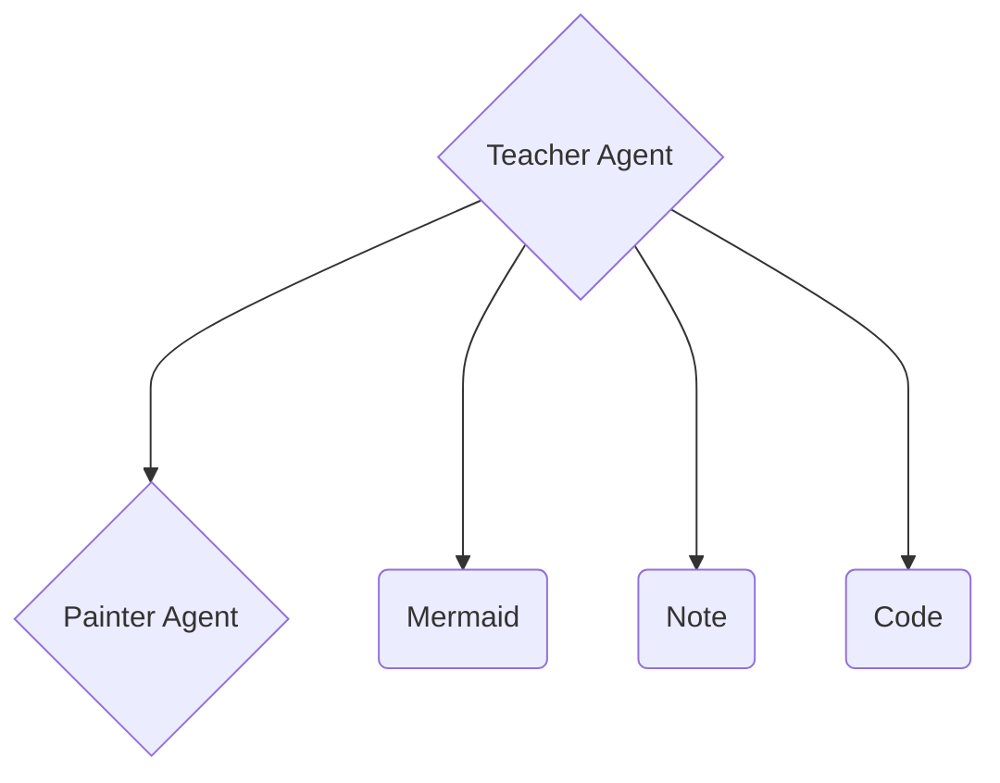

# 关于ChatTutor，我们做了什么

Hi, 这里是Acbox，ChatTutor的作者，以下是我的各种平台账号，可以通过这些账号获得最新的动态

- X/Twitter [@AcboxLiu](https://x.com/AcboxLiu)
- GitHub [@sheepbox8646](https://github.com/sheepbox8646)

最近，我开源了我的项目ChatTutor, 在15天内获得了600+ stars（截止写稿日已有641个stars），并在开源圈和AI圈收获了一些热度。这篇博客我将会系统性的介绍ChatTutor，包括

1. 什么是ChatTutor, 他和一些传统的ChatBot有什么不同，他和类似VideoTutor, Code2Video之类的产品又有什么不同
2. 关于Multi-Agent - Teacher与Painter
3. 关于DSL - 绘图引擎如何驱动？Agent如何用响应式变量与用户交互？

## 什么是ChatTutor

ChatTutor是一个可以使用白板的老师Agent，通过工具调用的形式将数学图形，笔记注释，思维导图绘制在像是幻灯片一样的多页白板上


我们希望模仿真实的老师上课时的样子，通过画图->讲解->距离，来让学生逐步掌握知识。期间，学生可以打断，并向老师提出问题，老师可以对上一步的白班作出修改或新建页面来解释学生的疑问

## 他和VideoTutor, Code2Video这类产品有什么不同

- [VideoTutor](https://videotutor.io)
- [Code2Video](https://github.com/showlab/Code2Video)

这类产品有一个共同点：都是基于Manim进行渲染的。Manim是Youtube博主[@3blue1brown](https://www.youtube.com/channel/UCYO_jab_esuFRV4b17AJtAw?sub_confirmation=1)基于Python开发的一个数学动画引擎，通过Python代码来生成一个精美的科普视频。

VideoTutor和Code2Video通过复杂的工作流，让LLM去生成Python代码，并最终渲染成视频。

ChatTutor实现了一个DSL语法，大量模仿了现代前端框架的设计，并实现了一些组件库，关于DSL, 请参考[这个小节](#关于dsl---响应式)

VideoTutor和Code2Video的最终产物都是视频，用户无法与其交互，也无法基于视频里的图形做二次修改。ChatTutor所渲染的图形都是可交互的，且全部渲染在前端，不需要考虑视频编译的时间，且可以通过与用户的交互产生反应。

## Multi-Agent: Teacher模型与Painter模型

我们使用了Multi-Agent架构来拆分他们的任务，其中：

- Teacher: 用户所在右侧看到的输出
- Painter: 负责绘图的LLM, 可以输出DSL语法

Teacher可以通过工具调用的形式输入自然语言，并通过Painter输出DSL语法



目前的Painter使用提示词方案，未来有考虑模型训练，也考虑单独把Painter拆成一个api服务，让别的应用可以使用Painter并将图形渲染到自己的网页

## 关于DSL - 响应式

我们使用了[`@vue/reactivity`](https://github.com/vuejs/core/tree/main/packages/reactivity)作为DSL的响应式基础，并且大量模仿了现代前端框架的设计

我们同时也写了很多数学组件和动画，未来将会增加物理，电路，化学等学科的图形支持

就比如，三角形ABC，Painter输出的DSL Document看起来会像是这样的：

> Teacher给Painter的提示词：`Draw a simple triangle, A = (0, 0), B = (3, 4), C = (1, 2)`

```xml
---
refs:
  x_A: '0'
---
<plane :range="[-1, 5]" :domain="[-1, 4]">
  <polygon type="line" :points="[[x_A, 0], [3, 4], [1, 2], [x_A, 0]]" color="primary"/>
  
  <dot :x="x_A" :y="0" color="primary" label="A" />
  <dot :x="3" :y="4" color="primary" label="B" />
  <dot :x="1" :y="2" color="primary" label="C" />
</plane>
```

文档包含一个yaml头，有一个refs的定义，即响应式变量，这个 `x_A` 最终会被渲染在前端并暴露给用户。用户和Teacher都可以操作这个变量。当 `x_A` 被更新时，A点的坐标也会被改变

同时，Painter支持一个键-值类型的参数，可以手动指定 `<变量名>-<变量描述>`，然后Painter就会把你指定的变量名暴露出来

我们来看一个更具体的例子：

> Input: 
> ```
> Draw a unit circle (radius 1) centered at the origin. Draw the x and y axes with labels.
> Draw a radius from the origin making an angle theta with the positive x-axis, where theta is a reactive variable starting at π/4. At the end of this radius, mark a point P. From point P, draw a vertical line down to the x-axis to form a right triangle.
> Label the horizontal distance as cos(theta) and the vertical distance as sin(theta).
> Draw and label the angle theta at the origin. Also show the coordinates of point P as (cos θ, sin θ).
> Use different colors: circle in gray, radius in blue, the right triangle sides in green, and point P in red.`
> ```
> Exposes: `{"theta": "角度 theta（弧度）"}`

```xml
---
refs:
  theta: 'Math.PI / 4'
---
<plane :range="[-1.5, 1.5]" :domain="[-1.5, 1.5]" axis grid>
  <!-- Unit circle in gray -->
  <parameter 
    :value="(t) => [Math.cos(t), Math.sin(t)]" 
    :domain="[0, 2 * Math.PI]" 
    color="gray"
  />
  
  <!-- Point P at (cos(theta), sin(theta)) in red -->
  <dot 
    :x="Math.cos(theta)" 
    :y="Math.sin(theta)" 
    color="red" 
    label="P"
    labelColor="red"
  />
  
  <!-- Radius from origin to P in blue -->
  <line 
    :from="[0, 0]" 
    :to="[Math.cos(theta), Math.sin(theta)]" 
    color="blue"
  />
  
  <!-- Vertical line from P down to x-axis (green) -->
  <line 
    :from="[Math.cos(theta), Math.sin(theta)]" 
    :to="[Math.cos(theta), 0]" 
    color="green"
  />
  
  <!-- Horizontal line from origin to projection point (green) -->
  <line 
    :from="[0, 0]" 
    :to="[Math.cos(theta), 0]" 
    color="green"
  />
  
  <!-- Angle theta at origin -->
  <angle 
    :start="[1, 0]" 
    :end="[Math.cos(theta), Math.sin(theta)]" 
    :origin="[0, 0]" 
    color="blue"
    label="θ"
  />
  
  <!-- Label for cos(theta) on x-axis -->
  <label 
    :x="Math.cos(theta) / 2" 
    :y="-0.15" 
    content="\cos(\theta)" 
    color="green"
  />
  
  <!-- Label for sin(theta) on y-axis -->
  <label 
    :x="Math.cos(theta) + 0.2" 
    :y="Math.sin(theta) / 2" 
    content="\sin(\theta)" 
    color="green"
  />
  
  <!-- Coordinates of point P -->
  <label 
    :x="Math.cos(theta) + 0.3" 
    :y="Math.sin(theta) + 0.2" 
    content="(\cos\theta, \sin\theta)" 
    color="red"
  />
</plane>
```


当Teacher让Painter做完这一切后，如图，Teacher调用其他工具创建了一个滑动条，当用户改变滑动条的值时，角度就会改变

我们正在计划准备给Teacher更多工具允许他自己操控这些组件

## 结尾

这就是这个博客的全部内容了，希望大家如果感兴趣可以来体验一下，并在GitHub上点一个Star

GitHub: [https://github.com/sheepbox8646/ChatTutor](https://github.com/sheepbox8646/ChatTutor)
在线体验（需要填写apikey）：[https://chattutor.app](https://chattutor.app)

